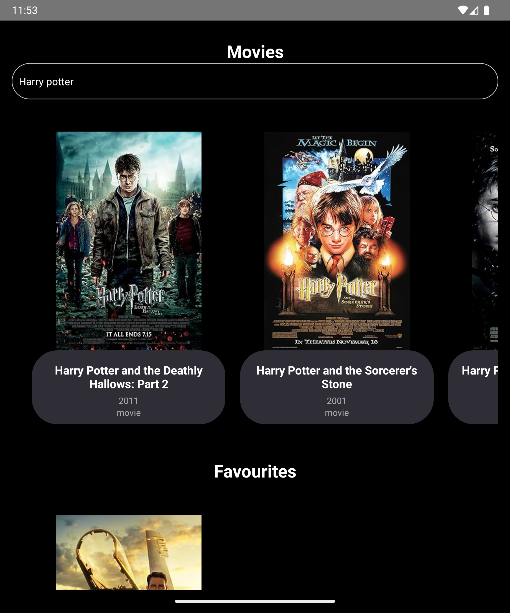
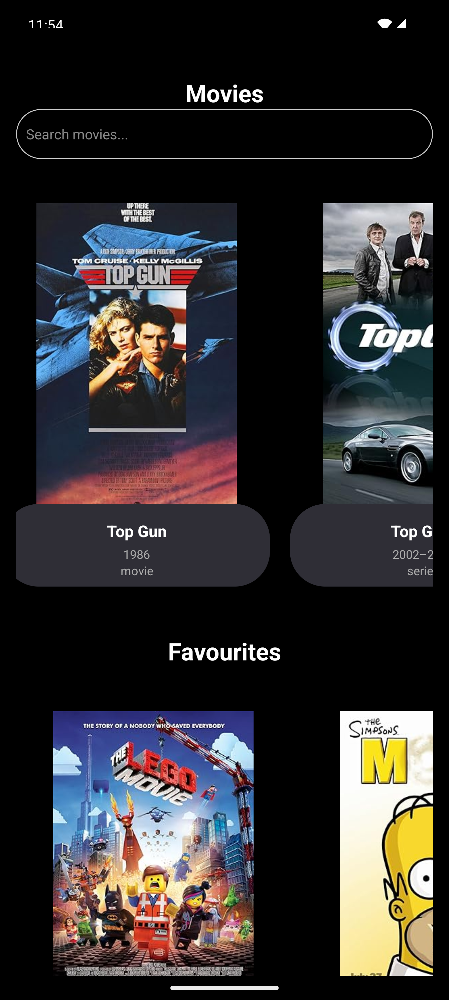
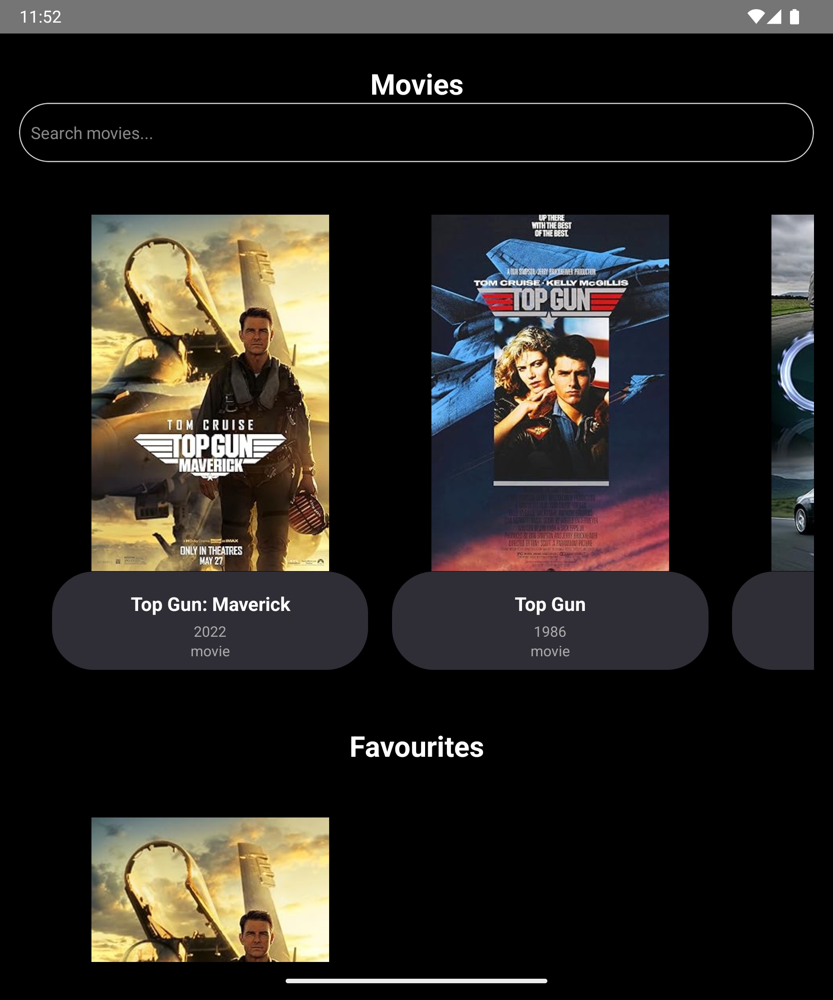
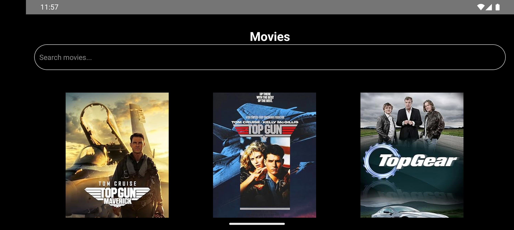
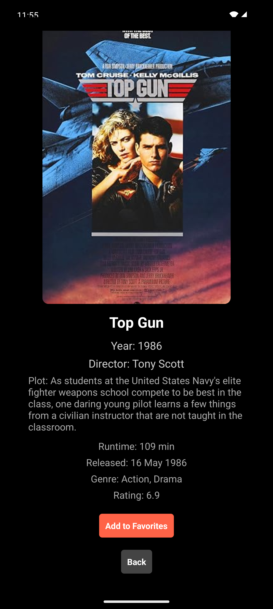

# React Native Movie App Documentation

## 1. Project Overview

### Project Name: React Native Movie App

### Description:
The React Native Movie App allows users to search for movies, view details, and add them to their favorites list. The app fetches movie data from the OMDB API and stores favorite movies using AsyncStorage. Users can browse movies and manage their favorites seamlessly.

### Features:
- Movie search functionality
- Displaying movie details
- Adding/removing movies to/from favorites
- Persistent storage of favorite movies

## 2. Setup Instructions

### Prerequisites:
- Node.js (v14.x or later)
- npm (v6.x or later) or yarn (v1.x or later)
- React Native CLI or Expo CLI
- Android Studio (for Android development)
- Xcode (for iOS development, macOS only)

### Steps to Setup:

1. *Clone the repository:*    
   bash    
   git clone https://github.com/arunsahu16/React_Native_MovieApp.git    
   cd React_Native_MovieApp    
   

2. *Install dependencies:*  

   If using npm:

   npm install

   If using yarn:

   yarn install
   

3. *Install Pods (for iOS):*

   cd ios    
   pod install    
   cd ..    
   

4. *Run the app:*    
   For Android:

   npx react-native run-android
   
   For iOS:

   npx react-native run-ios
   
### Create a'local.properties' file (for Android):
- Navigate to the 'android' directory in your project.
- Create a file named 'local.properties'.
- Add the following line to the local.properties file:

  sdk.dir=path/to/your/android/sdk

  Replace path/to/your/android/sdk with the actual path to your Android SDK directory.

### Environment Variables:
- Create a .env file in the root directory with the following content:
  
  API_KEY=your_omdb_api_key
  
- Ensure to add your actual OMDB API key.

## 3. Screenshots

### Note:
- Ensure that the Android emulator or iOS simulator is running before starting the app.
- If using a physical device, enable USB debugging (Android) or ensure the device is connected and trusted (iOS).